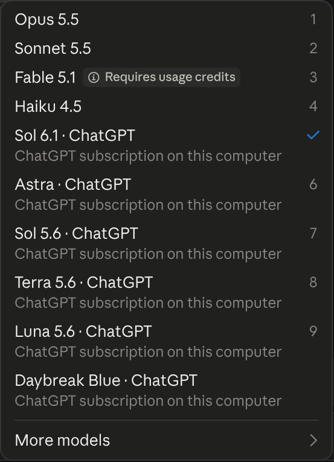

# Claude ChatGPT Bridge

Use your own ChatGPT plan in Claude Code through a local adapter for OpenAI's official **Sign in with ChatGPT** flow. Includes an agent-run setup workflow for the **Code tab of Claude Desktop** and a separate terminal launcher.

Experimental and unofficial. Linux bridge tests run locally; Windows/macOS implementations and desktop onboarding still need native end-to-end validation. This project is not affiliated with or endorsed by OpenAI or Anthropic. Use your existing Claude installation; no proprietary client code or prompts are distributed here.

The bridge translates Anthropic Messages requests into Responses API requests, streams the results back to Claude Code, and keeps OAuth credentials on your machine. Claude Code executes your local tools with its normal permission controls.

## Desktop preview



Screenshot from an existing customized local desktop setup, cropped to remove personal usage details. This shows ChatGPT options in its model picker; the repository installer uses the separate gateway configuration described below and does not reproduce this combined provider menu. Available models and labels depend on your account and client version.

## What it provides

- Browser sign-in, PKCE, ID-token validation, and access-token refresh.
- Account-specific model discovery, text, supported images/documents, and function tools.
- Streaming responses and preservation of tool-call history and opaque reasoning records.
- Stable conversation prefixes and local token/cache accounting. Cache hits and savings are not guaranteed.
- Automatic waiting after a subscription quota error, with five-minute minimum intervals and longer provider cooldowns respected. Checks stop when the waiting request disconnects. Requests that already produced output or tool activity are never automatically replayed.
- Resumable desktop setup, private gateway configuration, per-user background startup, verification and guarded undo.
- A separate process-scoped terminal launcher that keeps persistent Claude settings unchanged.

Your plan's limits still apply. This is not a way to bypass allowance or account access restrictions. Eligibility, models, and supported features depend on the account and the preview API.

## Let your desktop agent install it

Give your already-working Claude Code desktop agent this repository and say:

> Install this bridge for the Code tab of my Claude Desktop app, following CLAUDE.md. Keep my existing provider configuration available. Handle installation and desktop configuration, let me sign into ChatGPT myself, and verify a real desktop response before calling it complete.

[CLAUDE.md](CLAUDE.md) provides the agent workflow. [Desktop setup](DESKTOP_SETUP.md) explains commands, storage, restart checkpoints and rollback. The entry point is `python3 install.py setup` on Linux/macOS or `py -3 install.py setup` on Windows. Repeat with `continue` after an interruption; `doctor` reports what remains without sending model requests.

The installer creates an isolated runtime outside the checkout, signs in, discovers models, generates a private desktop import file and starts a background service. An agent with native UI tools then imports that file as a separate named configuration and verifies a response from the desktop. The user completes ChatGPT consent personally. App restarts, OS prompts or missing UI tools can leave a manual step; the installer reports pending until verification succeeds.

Selecting the gateway changes the desktop's active inference configuration. Existing Bedrock, Vertex or standard sign-in configurations must stay available for switching back. The bridge does not mix GPT models into an existing provider profile. Code is the target; Chat and Cowork may share the setting and are not validated.

## Requirements

- Python 3.11 or newer and a browser on the same computer. The existing installation agent can handle Python prerequisites.
- For desktop: an installed Claude Desktop with editable third-party inference configuration; a per-user systemd session on Linux, LaunchAgent support on macOS, or Task Scheduler on Windows. Managed profiles require administrator support.
- For terminal use: Claude Code installed with `claude` on your `PATH`.
- A ChatGPT account eligible for plan usage, with permission explicitly granted during sign-in.
- Loopback networking. Desktop setup picks free ports automatically; manual CLI defaults are 11438 (bridge) and 11439 (login).

The source integration was exercised with Claude Code 2.1.291. Other client versions may change the protocol. See [compatibility](COMPATIBILITY.md) before relying on a particular feature.

## Terminal-only alternative

Download or clone this repository, then run from its directory:

```sh
python3 -m venv .venv
. .venv/bin/activate
python -m pip install .
claude-chatgpt setup
claude-chatgpt login
claude-chatgpt models
```

Follow **Continue with ChatGPT** in the local browser page. Each installation creates its own opaque host identifier; each account authorizes its own registration. No shared client credentials are included.

Start the bridge in that terminal:

```sh
claude-chatgpt serve
```

In another terminal, activate the same environment and choose an exact model identifier returned by `models`:

```sh
. .venv/bin/activate
claude-chatgpt run --model chatgpt.MODEL_FROM_YOUR_LIST
```

The placeholder must be replaced with an available model. You can pass Claude options after `--`, for example `-- --continue`. The launcher selects manual tool approvals; it does not disable safety checks.

`serve` stays in the foreground. Stop it with Ctrl+C. After refreshing the model list or switching accounts, restart it. Run `claude` normally for your usual provider configuration.

## State and privacy

The Linux default is `$XDG_STATE_HOME/claude-chatgpt-bridge`, or `~/.local/state/claude-chatgpt-bridge` when XDG is unset. macOS uses `~/Library/Application Support/ClaudeChatGPTBridge/state`; Windows uses `%LOCALAPPDATA%/ClaudeChatGPTBridge/state`. It contains OAuth credentials, local bridge keys, the account model list, quota state, and a small rotating usage ledger. Desktop setup also stores private configuration and verification records. These are **runtime data, never files to upload or commit**.

State must be owned by you and private: POSIX `0700` directories/`0600` files, or a protected Windows ACL. Symlinked state, Windows reparse points and state inside Git checkouts are refused. Use a dedicated directory. Override it with `CLAUDE_CHATGPT_STATE_DIR` or `--state-dir` before the command. Set `--port` before the command on both `serve` and `run` when changing manual CLI ports.

The bridge binds only to `127.0.0.1`, requires a local key and rejects browser-origin inference requests. Desktop receives a separate key that cannot access admin health or native Claude forwarding. Tokens are never command-line arguments. Only ChatGPT authorization is sent to OpenAI. Explicit Claude forwarding, disabled by default, requires its own Claude OAuth credential and `serve --allow-claude` for CLI requests.

Prompts, tool results, and attachments are sent to the selected provider to answer your requests. Claude Code may retain them in its own session history. The bridge keeps bounded continuation data in memory, but its usage ledger records counts, model IDs and keyed fingerprints rather than conversation bodies or tokens. There is no project telemetry or automatic log upload. See [security and data handling](SECURITY.md).

## Maintenance

```sh
claude-chatgpt status                # Offline, identity redacted
claude-chatgpt usage                 # Offline retained token totals
claude-chatgpt accounts              # Numbered saved registrations
claude-chatgpt accounts --show-identity  # Explicitly print saved emails locally
claude-chatgpt accounts --select 1    # Restart serve after switching
claude-chatgpt login --new-account
claude-chatgpt logout                # Deselect account; stop/restart serve
```

Logout deselects the account locally; it does not revoke saved refresh tokens. Revoke the app's access in ChatGPT to end the authorization. Keep the host identifier stable if you intend to reconnect the same installation.

Normally quota recovery is automatic while a request remains connected. If the client already displayed an error, retry it once to attach a waiting request. `claude-chatgpt resume` clears local cooldown without making inference; use it only after a known reset. Usage totals are not your account's billing statement or remaining allowance percentage.

## Remove

For desktop, run `python3 install.py undo` (Windows: `py -3 install.py undo`). Restore the previous named desktop configuration or standard sign-in and restart, then run `undo --desktop-restored`. This removes only the owned service and desktop-local credential/config. OAuth state and the private previous-config backup remain for reuse.

For the terminal-only setup, stop `serve`, close the launched session and remove its dedicated virtual environment. After desktop rollback you may also remove the dedicated bootstrap runtime. Optionally revoke access in ChatGPT and delete the dedicated private state directory after checking its path. Never publish runtime files in an issue report.

## Develop and validate

```sh
python -m pip install '.[dev]'
python -c "import tiktoken; tiktoken.get_encoding('o200k_base')"
python -m pytest -q
python scripts/check_public.py
python scripts/build_release.py
```

Dependency installation and the initial tokenizer download use the network. Tests use synthetic credentials and loopback mock providers; they reject external network connections. They do not call models or consume subscription allowance. The release script builds from an allowlisted temporary copy, removes local user/group archive metadata, and scans both source and built packages. Dependency auditing uses package metadata, not account state:

```sh
python -m pip freeze --exclude claude-chatgpt-bridge > /tmp/bridge-dependencies.txt
python -m pip_audit -r /tmp/bridge-dependencies.txt --no-deps --disable-pip
```

## Official integration references

- [Sign in with ChatGPT for open-source apps](https://developers.openai.com/siwc/token-sharing-open-source)
- [Registration and sign-in](https://developers.openai.com/siwc/token-sharing-open-source/sign-in)
- [Preview limitations](https://developers.openai.com/siwc/token-sharing-open-source/preview-limitations)

MIT licensed. Contributions should use synthetic reproductions; see [CONTRIBUTING.md](CONTRIBUTING.md).
